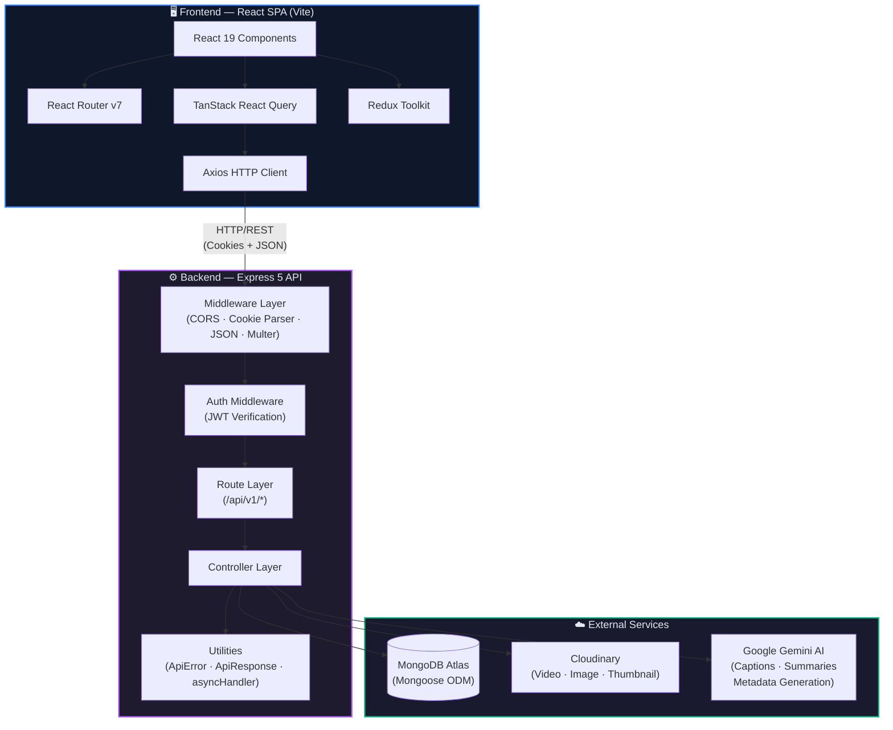
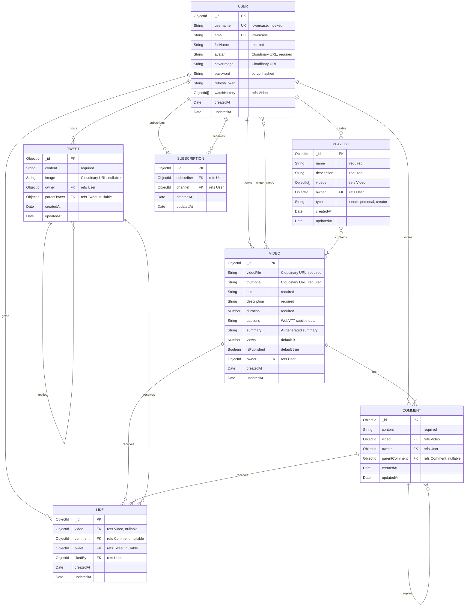
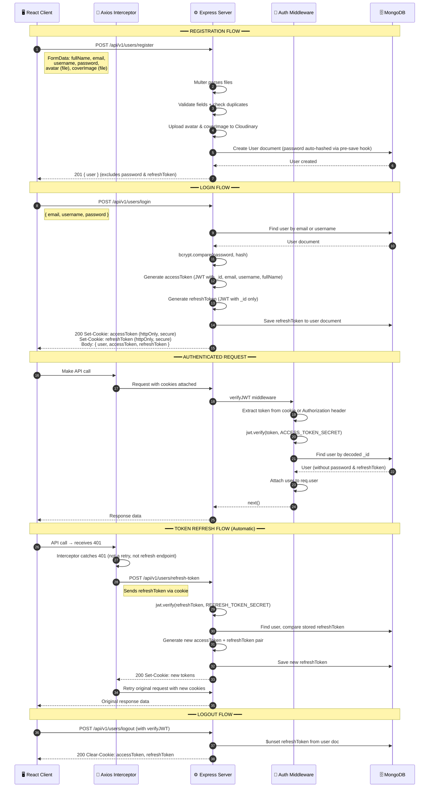
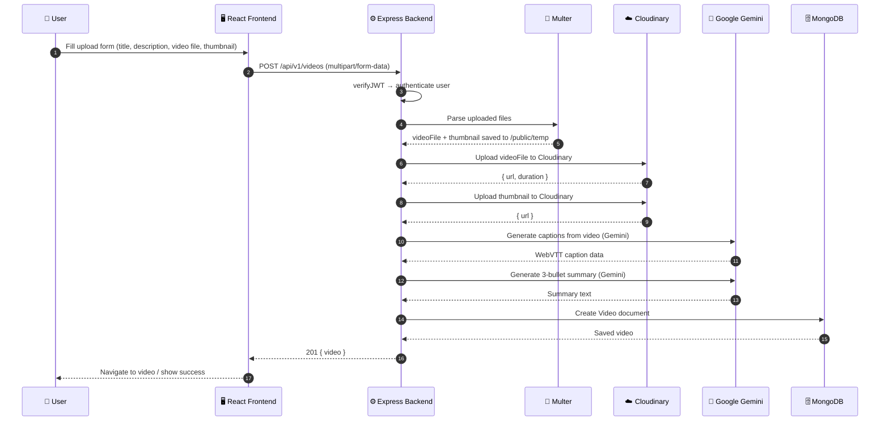
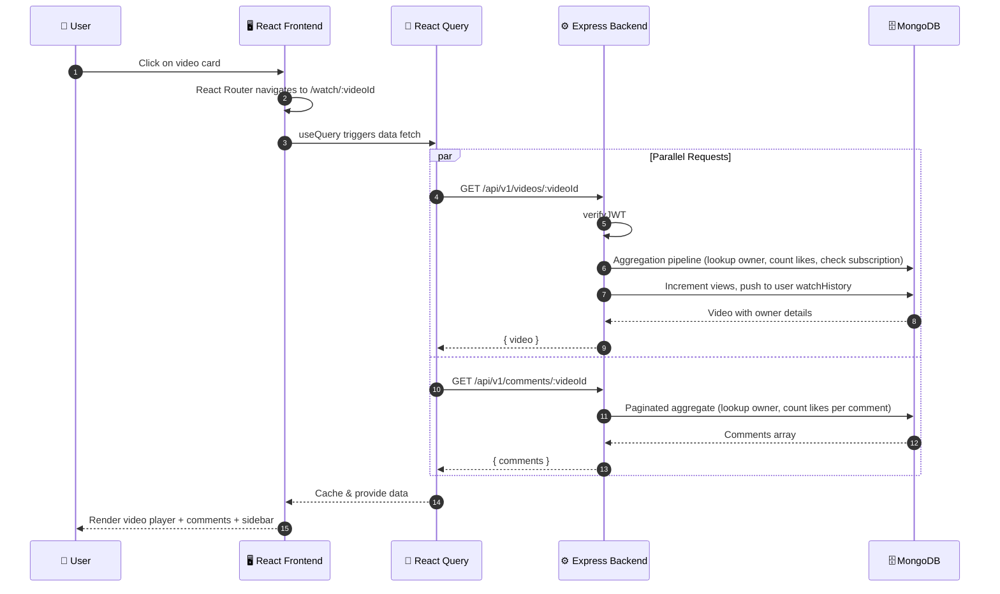
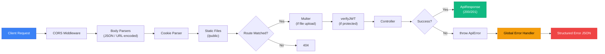

# 🏗️ YouTube Clone — Architecture Documentation

> **Author:** Rakshit Kaintura  
> **Last Updated:** July 2026  
> **Stack:** React 19 · Express 5 · MongoDB · Cloudinary · Gemini AI

---

## Table of Contents

1. [High-Level Architecture Diagram](#1-high-level-architecture-diagram)
2. [ER Diagram (Database Schema)](#2-er-diagram-database-schema)
3. [Authentication Flow](#3-authentication-flow)
4. [Request / Sequence Flow](#4-request--sequence-flow)
5. [Technology Decision Sheet](#5-technology-decision-sheet)

---

## 1. High-Level Architecture Diagram

The system follows a **client-server architecture** with a React SPA communicating with an Express REST API. Media assets are offloaded to Cloudinary, data is persisted in MongoDB Atlas, and AI features are powered by Google Gemini.

### Layer Breakdown

| Layer | Responsibility |
|---|---|
| **React SPA** | UI rendering, routing, client state (Redux), server state (React Query) |
| **Axios Client** | API calls with automatic 401 → refresh-token retry interceptor |
| **Express Middleware** | CORS, body parsing (50 MB limit), cookie parsing, static file serving |
| **Auth Middleware** | JWT access-token verification from cookies or `Authorization` header |
| **Route → Controller** | RESTful endpoints mapped to business logic handlers |
| **Cloudinary** | Video/image upload, storage, and CDN delivery |
| **Google Gemini** | AI-powered caption generation, video summaries, and metadata generation |
| **MongoDB** | Document-based persistence via Mongoose with aggregate pagination |

---

## 2. ER Diagram (Database Schema)

All models use Mongoose schemas with `timestamps: true` (auto `createdAt` / `updatedAt`).

### Schema Notes

| Model | Special Features |
|---|---|
| **User** | Pre-save hook hashes password via `bcrypt(10)`. Methods: `isPasswordCorrect()`, `generateAccessToken()`, `generateRefreshToken()` |
| **Video** | Uses `mongoose-aggregate-paginate-v2` for paginated queries. Stores AI-generated `captions` (WebVTT) and `summary` |
| **Comment** | Supports nested replies via self-referencing `parentComment` field |
| **Like** | Polymorphic — a single Like doc can reference a Video, Comment, OR Tweet (only one is set) |
| **Tweet** | Community post system with optional image and threaded replies via `parentTweet` |
| **Playlist** | Typed as `personal` (saved/watch-later) or `creator` (channel playlists) |
| **Subscription** | Join table: `subscriber` (who subscribes) → `channel` (who they subscribe to) — both reference User |

---

## 3. Authentication Flow

The system uses a **dual-token JWT strategy** with HTTP-only cookies for security.

### Key Security Decisions

| Aspect | Implementation |
|---|---|
| **Password Storage** | Hashed with `bcrypt` (salt rounds: 10) via Mongoose pre-save hook |
| **Access Token** | Short-lived JWT containing `_id`, `email`, `username`, `fullName` |
| **Refresh Token** | Longer-lived JWT containing only `_id`, stored in DB for revocation |
| **Cookie Settings** | `httpOnly: true` (no JS access), `secure: true` (HTTPS only) |
| **Token Delivery** | Dual: sent as HTTP-only cookies AND in response body |
| **Auto-Refresh** | Axios interceptor catches 401 → calls `/refresh-token` → retries original request |
| **Refresh Failure** | Clears Redux auth state → redirects to `/login` |
| **Route Protection** | Frontend: `<ProtectedRoute>` + `<GuestRoute>` components. Backend: `verifyJWT` middleware |

---

## 4. Request / Sequence Flow

### 4.1 — Video Upload Flow

### 4.2 — Video Watch Flow

### 4.3 — General API Request Lifecycle

### API Endpoints Summary

| Module | Endpoint | Methods | Auth Required |
|---|---|---|---|
| **Healthcheck** | `/api/v1/healthcheck` | GET | ❌ |
| **Users** | `/api/v1/users/register` | POST | ❌ |
| | `/api/v1/users/login` | POST | ❌ |
| | `/api/v1/users/logout` | POST | ✅ |
| | `/api/v1/users/refresh-token` | POST | ❌ |
| | `/api/v1/users/current-user` | GET | ✅ |
| | `/api/v1/users/change-password` | POST | ✅ |
| | `/api/v1/users/update-account` | PATCH | ✅ |
| | `/api/v1/users/avatar` | PATCH | ✅ |
| | `/api/v1/users/cover-image` | PATCH | ✅ |
| | `/api/v1/users/c/:username` | GET | ✅ |
| | `/api/v1/users/history` | GET | ✅ |
| **Videos** | `/api/v1/videos` | GET, POST | ✅ |
| | `/api/v1/videos/:videoId` | GET, PATCH, DELETE | ✅ |
| | `/api/v1/videos/toggle/publish/:videoId` | PATCH | ✅ |
| | `/api/v1/videos/:videoId/summary` | GET | ✅ |
| | `/api/v1/videos/generate-metadata` | POST | ✅ |
| **Comments** | `/api/v1/comments/:videoId` | GET, POST | ✅ |
| **Likes** | `/api/v1/likes/*` | POST/GET | ✅ |
| **Tweets** | `/api/v1/tweets` | GET, POST, PATCH, DELETE | ✅ |
| **Subscriptions** | `/api/v1/subscriptions/*` | POST, GET | ✅ |
| **Playlists** | `/api/v1/playlist` | CRUD | ✅ |
| **Dashboard** | `/api/v1/dashboard` | GET | ✅ |

---

## 5. Technology Decision Sheet

### Backend Stack

| Technology | Version | Purpose | Why This Choice |
|---|---|---|---|
| **Node.js** | 20+ | Runtime | Non-blocking I/O ideal for media-heavy API; massive ecosystem |
| **Express** | 5.x | HTTP Framework | Industry standard, minimal overhead, excellent middleware ecosystem |
| **MongoDB** | Latest | Database | Document model maps naturally to video/user data; flexible schema for evolving features |
| **Mongoose** | 9.x | ODM | Schema validation, middleware hooks (pre-save password hashing), population, aggregation pipelines |
| **mongoose-aggregate-paginate-v2** | 1.x | Pagination | Efficient server-side pagination for videos, comments, and tweets |
| **bcrypt** | 6.x | Password Hashing | Industry-standard adaptive hashing; resistant to brute-force attacks |
| **jsonwebtoken** | 9.x | Authentication | Stateless auth via dual-token (access + refresh) JWT strategy |
| **Cloudinary** | 2.x | Media Storage | Managed CDN for video/image hosting; on-the-fly transformations; no self-hosted storage needed |
| **Multer** | 2.x | File Upload | Multipart form parsing; temp file storage before Cloudinary upload |
| **@google/genai** | 2.x | AI Features | Gemini API for auto-generating captions (WebVTT), video summaries, and metadata |
| **cookie-parser** | 1.x | Cookie Handling | Parse HTTP-only cookies for JWT token extraction |
| **cors** | 2.x | CORS | Configurable origin whitelist with localhost auto-allow for development |
| **dotenv** | 17.x | Config | Environment variable management for secrets and configuration |
| **nodemon** | 3.x | Dev Tooling | Auto-restart server on file changes during development |

### Frontend Stack

| Technology | Version | Purpose | Why This Choice |
|---|---|---|---|
| **React** | 19.x | UI Framework | Component-based architecture; latest features (Suspense, lazy loading) |
| **Vite** | 8.x | Build Tool | Instant HMR, fast cold starts, native ESM — drastically faster than Webpack |
| **React Router DOM** | 7.x | Routing | Declarative routing with nested layouts, protected routes, lazy loading |
| **Redux Toolkit** | 2.x | Client State | Auth state, UI preferences; predictable state container with minimal boilerplate |
| **TanStack React Query** | 5.x | Server State | Automatic caching, background refetch, pagination, optimistic updates for API data |
| **Axios** | 1.x | HTTP Client | Interceptor-based auto-refresh on 401; cleaner API than fetch for complex flows |
| **React Hook Form** | 7.x | Form Management | Performant (uncontrolled inputs); minimal re-renders; clean validation API |
| **Zod** | 4.x | Schema Validation | Type-safe validation schemas; pairs with `@hookform/resolvers` for form validation |
| **TailwindCSS** | 4.x | Styling | Utility-first CSS; rapid prototyping with consistent design tokens |
| **tailwind-merge** | 3.x | Class Utilities | Resolves conflicting Tailwind classes in component composition |
| **clsx** | 2.x | Class Utilities | Conditional class name construction for dynamic styling |
| **Lucide React** | 1.x | Icons | Tree-shakeable, consistent icon set; lightweight alternative to icon fonts |
| **oxlint** | 1.x | Linting | Blazing-fast Rust-based linter; faster alternative to ESLint |

### Architecture Decisions

| Decision | Choice | Rationale |
|---|---|---|
| **Monorepo vs Polyrepo** | Monorepo (`/backend` + `/frontend`) | Simpler development workflow; shared `.git` history; co-located documentation |
| **REST vs GraphQL** | REST | Simpler to implement; sufficient for CRUD-heavy video platform; better caching semantics |
| **Auth Strategy** | JWT (dual-token, cookies) | Stateless backend; HTTP-only cookies prevent XSS token theft; refresh token enables long sessions |
| **State Split** | Redux (client) + React Query (server) | Clear separation: Redux owns auth/UI state, React Query owns API cache with auto-invalidation |
| **File Storage** | Cloudinary (not self-hosted) | Zero infrastructure for media CDN; built-in video processing; scalable without DevOps overhead |
| **AI Integration** | Google Gemini API | Powerful multimodal capabilities for video understanding; generates captions + summaries from video content |
| **API Versioning** | URL-based (`/api/v1/`) | Simple, explicit versioning; easy to run v1 and v2 simultaneously during migration |
| **Error Handling** | Centralized `ApiError` + global handler | Consistent error response format; single point of error logging; only 500s logged to console |
| **Code Splitting** | React.lazy + Suspense | Reduces initial bundle size; pages load on demand with animated loading state |
| **Form Validation** | Dual-layer (Zod frontend + Mongoose backend) | Client-side for UX; server-side for security — never trust the client |
| **Pagination** | Aggregate pipeline + paginate plugin | Efficient for large datasets; supports complex lookups (join owner, count likes) in single query |

---

> **📌 Note:** This documentation reflects the current state of the codebase. Update this file as the architecture evolves.
